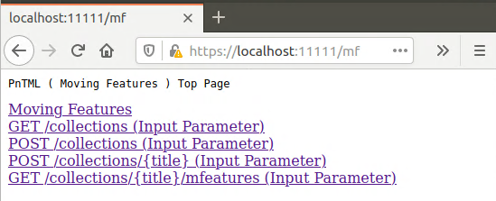

# Welcome
  Welcome to MovingFeatures Quickstart Introduction.  

  We provide two ways to access the MovingFeatures server.  
  This guide will help you access MovingFeatures Server with browser.

** Requisites**  

- You have installed the JDK  (at least Java8) .  
- You have installed the Maven  (at least Maven3.6) .  

** Quick Start **  
  Access to MovingFeatures server with browser.  

** Examples **  
  Access to MovingFeatures server with java or python Examples.  
---

## ClientId and ClientSecret
** No matter which way you access the server, you need to get Client Id and Client Secret at first.**  
** If you already have the Client Id and Client Secret, skip to Quick Start. **  


- First, Access the following url to login server Using your user and password.  
[https://dps.aaic.hpcc.jp/pntml/user](https://dps.aaic.hpcc.jp/pntml/user)

- When you logged in Successfully, Add a new application(Add Application Button).

  
- **Input Application Information(Using Default values as follwing).**  
    you could input Application Name And Description with any value. 
>| Application Name | Redirect(Callback) URL | Homepage URL | Description |
>| ------------ | ------------- | ------------ | ------------ |
>| User01Application | https://localhost:11111/callback  | https://localhost:11111/index | Nini Description |  

    Client Id and  Client Secret will be created when you clicked the save button.  
    **Write a memo, It will be used when you  access our server.**  

---

## Quick Start

- ** Get PnTML-Client Project.**  
    To Connect with our team.
    
- **Edit PnTML-Client.**  
    
    1. To Edit oauth.properties with Client Id and Client Secret.  
    
        ```cd PnTML-Client  
         vim src/main/resources/oauth.properties
        ```  
    
            spring.security.oauth2.client.clientId='input your clientId'  
            spring.security.oauth2.client.clientSecret='input your clientSecret'   

    2.  Edit application.properties.  
        To Edit application.properties with a key-store-password And a tomcat.basedir.  
        ```
            vim src/main/resources/application.properties  
        ```  
    
            server.port=11111  
            
            server.ssl.key-store=./keystore.p12  
            server.ssl.key-store-password='input password'  
            server.ssl.keyStoreType=PKCS12  
            server.ssl.keyAlias=tomcat  
            
            server.tomcat.basedir='input tomcat log dir'  


     3. Create keystore.p12 file.  
        To Create keystore.p12 file with key-store-password what you inputted above.  
        When you execute the following command, you Also need to input other informations except password(it can be angthing).  
        
        
        ```
            keytool -genkey -alias tomcat -storetype PKCS12 -keyalg RSA -keysize 2048 -keystore keystore.p12 -validity 3650  
        ```  
     
     
     4. Start PnTML-Client  
        To compile PnTML-Client.  
         
         ```
         mvn compile  
         mvn package  
         ```
         
         To Start PnTML-Client Server.  
             ```java -Djava.net.preferIPv4Stack=true -jar target/pntml-client-1.0.0.jar```  
             

## Access Server
- ** To Access Pntml Server with the following URL.**  

     [https://localhost:11111/index](https://localhost:11111/index)

- ** Access MovingFeatures**  
     When you logged in Successfully, a list of URL will be seen.  
       
     To click The  **Moving Feature ** link to access MovingFeatures Server API list.  
       
     Now, you could use MovingFeatures GET or POST methods with the follwing links.
     
     1. **post a collection**  
     To click The  **POST /collections(Input Parameter) ** link to post a collection into MovingFeatures.  
     It's [**POST /collections **](https://dprtairc.github.io/pntml/mf-api.html#operation/registerMetadata) of MF-API.   
     
     **Fill with the following values:**   

         > example 

         | Key | Example Value  | Required | 
         | ---------- | :---------- |:---------- |
         | __`title`__ | Test001  | yes |
         | __`tags`__  | test,dummy   | no |
         | __`updateFrequency`__  | 5 | yes |
         | __`description`__  | this is a test title | no |

         **Submit**   
             Click submit button.   
         **Results:**  
         
         ```
            {
           "link":{
              "href":"https://dpsdev.aaic.hpcc.jp/mf/collections/Test001","title":"Test001"
                 }
          }
         ```  
         
     2. **post a movingFeature into  Collection **  
     To click The  **POST /collections/{title}(Input Parameter) ** link to post a Moving Feature into 'Test001'.  
     It's [**POST /collections/{title} **](https://dprtairc.github.io/pntml/mf-api.html#operation/insertFeatures) of MF-API.   
     At First, you need to create a test.json file with the follwing:  
     ```
         {
           "type": "Feature",
           "id": "example01",
           "properties": {
             "name": "car1",
             "state": "test1"
           },
           "temporalGeometry": {
             "type": "MovingPoint",
             "datetimes": [
               "2011-07-14T22:01:01.000Z",
               "2011-07-14T22:01:02.000Z"
             ],
             "coordinates": [
               [
                 139.757083,
                 35.627701,
                 0.5
               ],
               [
                 139.757399,
                 35.627701,
                 2
               ]
             ],
             "interpolation": "Linear"
           },
           "temporalProperties": [
             {
               "datetimes": [
                 "2011-07-14T22:01:01.450Z",
                 "2011-07-14T23:01:01.450Z"
               ],
               "length": {
                 "type": "Measure",
                 "form": "http://www.qudt.org/qudt/owl/1.0.0/quantity/Length",
                 "values": [
                   1,
                   2.4
                 ],
                 "interpolation": "Linear",
                 "description": "description1"
               }
             }
           ]
         }
     ```
     
         **secondly, Fill with the following values:**   
     
         > example 
         
         | Key | Example Value  | Required |  
         | ---------- | :---------- |:---------- |
         | __`title`__ | Test001  | yes |
         | __`jsonFile`__  | test.json (selected)  | yes |  

         **Submit**   
         Click submit button.    
         **Results:**
         
         ```
            {
                "link": [
                    {
                        "href": "https://dpsdev.aaic.hpcc.jp/mf/collections/Test001/mfeatures/example01",
                        "title": "example01"
                    }
                ]
            } 
         ```
     
     3. **get collections(catalog)**  
     To click The  **GET /collections(Input Parameter) ** link to get collections of MovingFeatures.  
     It's [**GET /collections **](https://dprtairc.github.io/pntml/mf-api.html#operation/searchCatalog) of MF-API.   
     **Fill with the following values:**   

         > example 

         | Key | Example Value  | Required | 
         | ---------- | :---------- |:---------- |
         | __`bbox`__ | 138,35,140,36  | no |
         | __`time`__  | 2011-07-14T22:01:01.000Z,2011-07-14T22:01:02.000Z   | no |
         | __`tag`__  | dummy | no |

         **Submit**   
             Click submit button.   
         **Results:**  
         
         ```
           {
                "collections": [
                    {
                        "id": "Test001",
                        "itemType": "Feature",
                        "extent": {
                            "tags": [
                                "dummy",
                                "test"
                            ],
                            "spatial": {
                                "bbox": [
                                    139.757083,
                                    35.627701,
                                    139.757399,
                                    35.627701
                                ]
                            },
                            "temporal": {
                                "interval": [
                                    "2011-07-14T22:01:01.000+0000",
                                    "2011-07-14T22:01:02.000+0000"
                                ]
                            }
                        },
                        "links": [
                            {
                                "rel": "self",
                                "href": "https://dpsdev.aaic.hpcc.jp/mf/collections/Test001"
                            }
                        ]
                    }
                ],
                "links": [
                    {
                        "rel": "self",
                        "href": "https://dpsdev.aaic.hpcc.jp/mf/collections"
                    }
                ]
            }
         ```  
     4. **get movingFeatures of collection**  
     To click The  **GET /collections/{title}/mfeatures (Input Parameter) ** link to get MovingFeatures of collection.  
     It's [**GET /collections/{title}/mfeatures **](https://dprtairc.github.io/pntml/mf-api.html#operation/retrieveFeatures) of MF-API.   
     **Fill with the following values:**   

          > example 

          | Key | Example Value  | Required | 
          | ---------- | :---------- |:---------- |
          | __`title`__ | Test001  | yes |
          | __`bbox`__ | 138,35,140,36  | yes |
          | __`time`__  | 2011-07-14T22:01:01.000Z,2011-07-14T22:01:02.000Z   | yes |
          | __`format`__  |  | no |

          **Submit**   
              Click submit button.   
          **Results:**  
          
          ```
          {
              "timeStamp": "2020-08-26T09:22:36.036+00:00",
              "features": [
                  {
                      "bbox": [
                          139.757083,
                          35.627701,
                          0.5,
                          139.757399,
                          35.627701,
                          2
                      ],
                      "id": "example01",
                      "time": [
                          "2011-07-14T22:01:01.000+0000",
                          "2011-07-14T22:01:02.000+0000"
                      ],
                      "type": "Feature",
                      "properties": {
                          "name": "car1",
                          "state": "test1"
                      }
                  }
              ],
              "numberReturned": 1,
              "links": [
                  {
                      "rel": "self",
                      "href": "https://dpsdev.aaic.hpcc.jp/mf/collections/Test001/mfeatures"
                  }
              ],
              "type": "FeatureCollection",
              "numberMatched": 1
          }
          ```